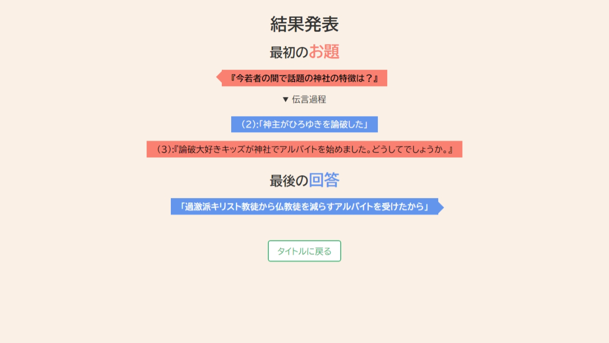

# 大喜利伝言ゲーム

お絵描き伝言ゲーム [Gartic Phone](https://garticphone.com/ja) の大喜利版です。[SvelteKit](https://kit.svelte.jp/), [Node.js](https://nodejs.org/ja/), [Express](https://expressjs.com/ja/), [Socket.IO](https://socket.io/) を使用しています。



## 遊び方


1. 1 人目が大喜利の**お題**を考えます (例: パソコンを起動して最初にすることとは？)
1. 2 人目がその大喜利のお題を見て、**回答**を考えます (例: Caps Lock を押す)
1. 3 人目がその回答を見て、元の大喜利の**お題**を予想します (例: 親友に絶交される行為第 38 位とは！？)
1. 4 人目がそのお題を見て、新たに**回答**を考えます (例: クソリプ)
1. 4 人プレイならここで終了で、6 人以上ならこれを最後の人まで繰り返します
1. 終わったら、**最初のお題**と**最後の回答**を照らし合わせて、面白くなるかどうかを楽しみます (例では、「パソコンを起動して最初にすることとは？」「クソリプ」の対ができた)

このゲームのポイントは、**本来の大喜利では面白くするために参加者の奇抜な発想が求められていたところが、伝言ゲームと組み合わせることで勝手に奇抜に面白くなる**ところにあります。発想力不足で大喜利を楽しめなかった方にもおすすめです！

ローカルプレイでは、1 台の端末を複数人で回して遊びます。オンラインプレイでは、各自が端末を用意してネットワーク経由で遊びます。ローカルプレイの場合、最初のページ読み込み以外のネットワーク通信はありません。

## ビルド

[Node.js](https://nodejs.org/ja/) が必要です。開発段階では 18.13.0 LTS と 19.4.0 が最新で、どちらでも動作しています。また、本格的に開発を行う場合は [Svelte の環境構築](https://svelte.jp/docs)も推奨します。

```bash
git clone https://github.com/littlegirl0820/semi-b.git
cd semi-b
npm i
npm run build
node index.js
```

また、開発用に以下のコマンドも使用可能です。予め、`npm i` の実行が必須です。

- `npm run dev` : Hot-reload 等のデバッグ機能が使える開発版ビルドを実行します
- `npm run format` : コードスタイルの統一を行います
- `npm run lint` : コード上の問題を発見し、より良いコードにするための提案を表示します
  - `npm run format` が実施された状態で行う必要があります
